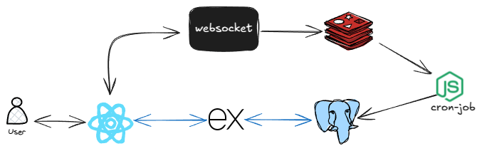

# Scalable Chat Application - Setup Guide



## Overview
This is a scalable, high-performance chat application built using a monorepo architecture with Turborepo. It leverages PostgreSQL for data persistence and Redis for caching and real-time messaging.

## Prerequisites
Before proceeding, ensure you have the following installed:
- Node.js (latest LTS version recommended)
- PostgreSQL (running instance required)
- Redis (running instance required)

## Installation & Setup

### 1. Clone the Repository
```sh
git clone https://github.com/sidharthtripathi/chat-app-turborepo
```

### 2. Navigate into the Project Directory
```sh
cd chat-app-turborepo
```

### 3. Install Dependencies
```sh
npm install
```

### 4. Set Up Environment Variables
Each application within the `apps/` workspace contains a `.env.example` file. Copy and configure these environment files for each application:
```sh
cp apps/*/.env.example apps/*/.env
```
Ensure your `.env` files include the correct PostgreSQL and Redis configurations.

### 5. Initialize the Database
```sh
npm run db:init
```

### 6. Generate Prisma Client
```sh
npm run prisma:generate
```

### 7. Start the Development Server
```sh
npm run dev
```
The application will now be accessible at the designated ports.


